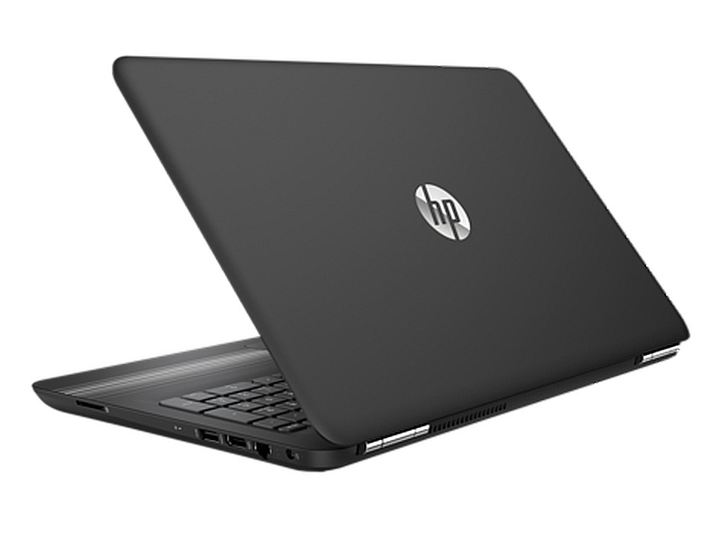

<html>
<head>

<title></title>
<meta charset="utf-8">
<link rel="stylesheet" type="text/css" href="style2.css">
<meta name="forma-detection" content="telephone=no"/>
<meta name="author" content="S Albert"/>
<meta name="vieport" content="width=device-width,
                              height=device-height"/>
<meta name="them-color" content="#fffccc"/>
<meta name="keywords" content="Купить компьютер,Девайсы,BuyDevice"/>
<meta name="description" content=""/>
<meta name="og:title" content="" />
<link rel="stylesheet" type="text/css" href="style1.css">
</head>
<body style="font-family: cooper black">

        <h2 flex md-truncate style="color:#fff;
         position:absolute; 
            left:1vw;
            top: 0.1vh;"
         ><big><strong> <em>BuyDevice</em></strong></big></h2>
        <a href="https://sakhibullin.github.io/Kompa.github.io/" style="color:#fff;
       position: absolute;
        top: 2vw;
        left:80vw;
         "> Главная</a>
                  <a href="https://sakhibullin.github.io/Komp3.github.io/" style="color:#Fff;
        position: absolute;
        top: 2vw;
        left:75vw;
         "> Корзина/</a>
         
Наши контакты 7(xxx)xxx-xx-xx

   

   <input type="e-mail" placeholder="Поиск..." name="Поиск" style="
position: absolute;
top: 2vh;
left: 23vw;
width: 43vw;
height: 6vh;
">

	<a href="#" onclick="document.getElementById('wtf').style.display='block'
document.getElementById('black').style.display='block';
	">

</a>
	<a href="#" onclick="document.getElementById('wtf2').style.display='block'
	document.getElementById('black').style.display='block';">

</a><a href="#" onclick="document.getElementById('black').style.display='block'
 document.getElementById('wtf3').style.display='block'"

>

</a>

    

    

  

Характеристики

<a href="#"  
onclick="
document.getElementById('d').style.display='block';document.getElementById('black').style.display='block';"
style="position: absolute;
    top: 86.5vh;
    left: 32vw;"
>

Доставить

</a>

Похожие товары

Вы выбрали Доставку

Город:

<select style="
position: absolute;
top:7vh;
left:6vw;
">
<option>Казань</option>
<option>Москва</option>	
<option>Воронеж</option>
</select>

Укажите улицу
<input type="text" name="Улица"
style="
position: absolute;
top:12.2vh; 
left:12vw;
width: 11vw;
height:3vh;
" 
>

Номер карты:
<input type="text" name="Номер" style="
position: absolute;
top:12vh ;
left:25vw ;
width: 8vw;
height: 3vh;
">

Срок действия:

<select style="
position: absolute;
top:21vh ;
left:2vw ;
">
	<option>1</option>
		<option>2</option>
		<option>3</option>
		<option>4</option>
		<option>5</option>
		<option>6</option>
		<option>7</option>
		<option>8</option>
		<option>9</option>
		<option>10</option>
		<option>11</option>
		<option>12</option>

</select>
<select style="
position: absolute;
top:21vh ;
left:6vw ;
">
		<option>2018</option>
		<option>2017</option>
		<option>2016</option>
		<option>2015</option>
		<option>2014</option>
</select>

Имя владельца:

<input type="text" name="like" style="
position: absolute;
top:21vh ;
left:15vw ;
width: 10vw;
height:3vh ;
">

CVV2:

<input type="text" name="CVV2" style="
position: absolute;
top: 26.3vh;
left: 5vw;
width:5vw ;
height:3vh ;
">
<a href="" onclick="document.getElementById('d').style.display='none'"
style="
position: absolute;
top:29vh ;
left:14vw ;
width:8vw ;
height:8vh ;
color: #000;
border-style: solid;
border-radius: 5%;
border-color: #c5ced8; 

" 
>
 Оплатить
</a>

Похожие товары

Системный блок Gray  i5-6600K 3.1GHz   16GB   1TB + 25 GB SSD   Дискретная Radeon RX 550 br Win 10 Home

</body>
</html>

